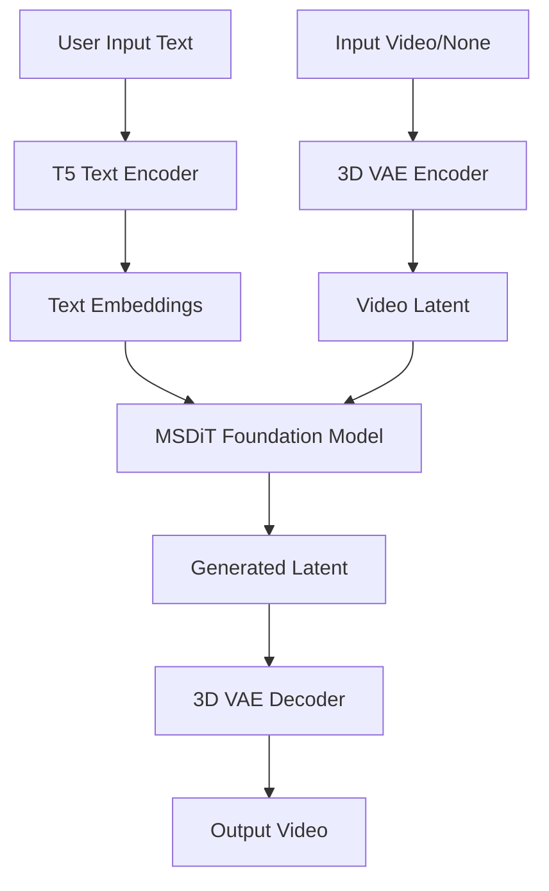
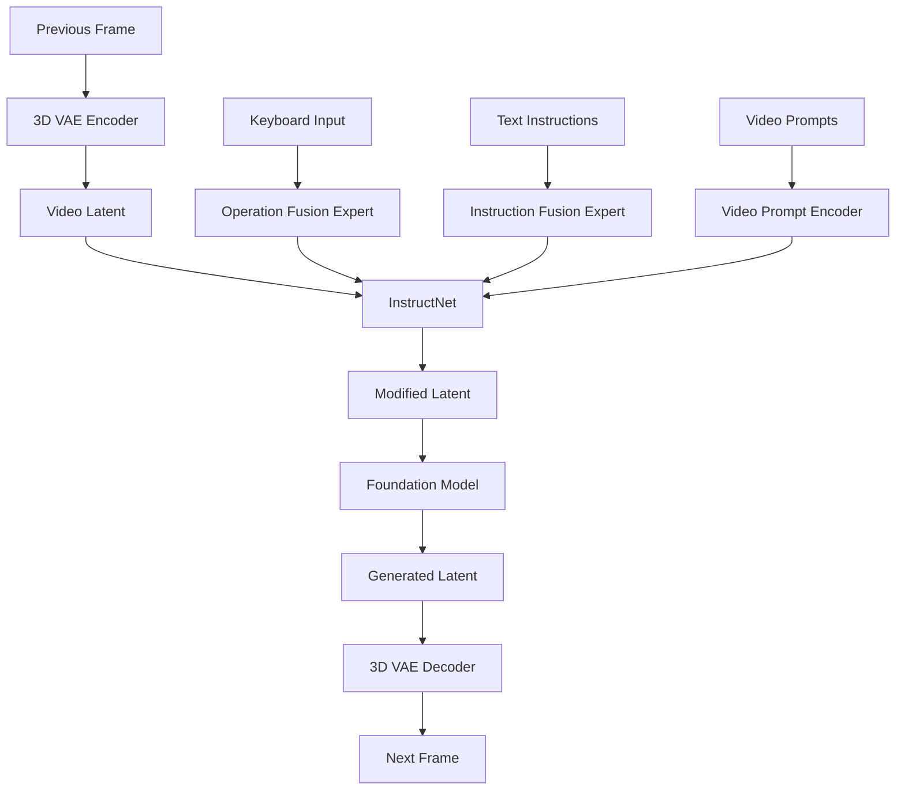
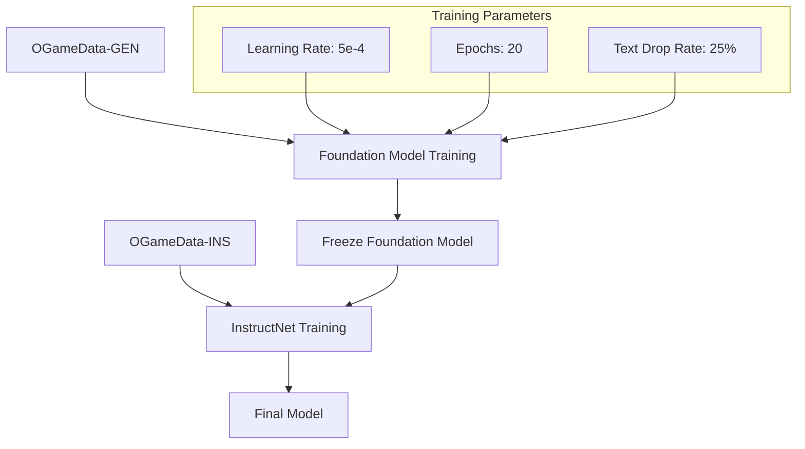
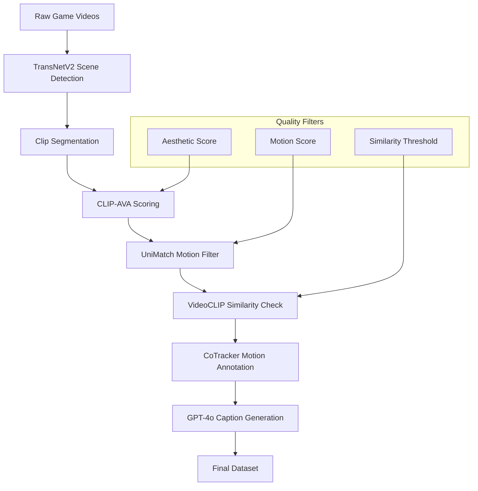
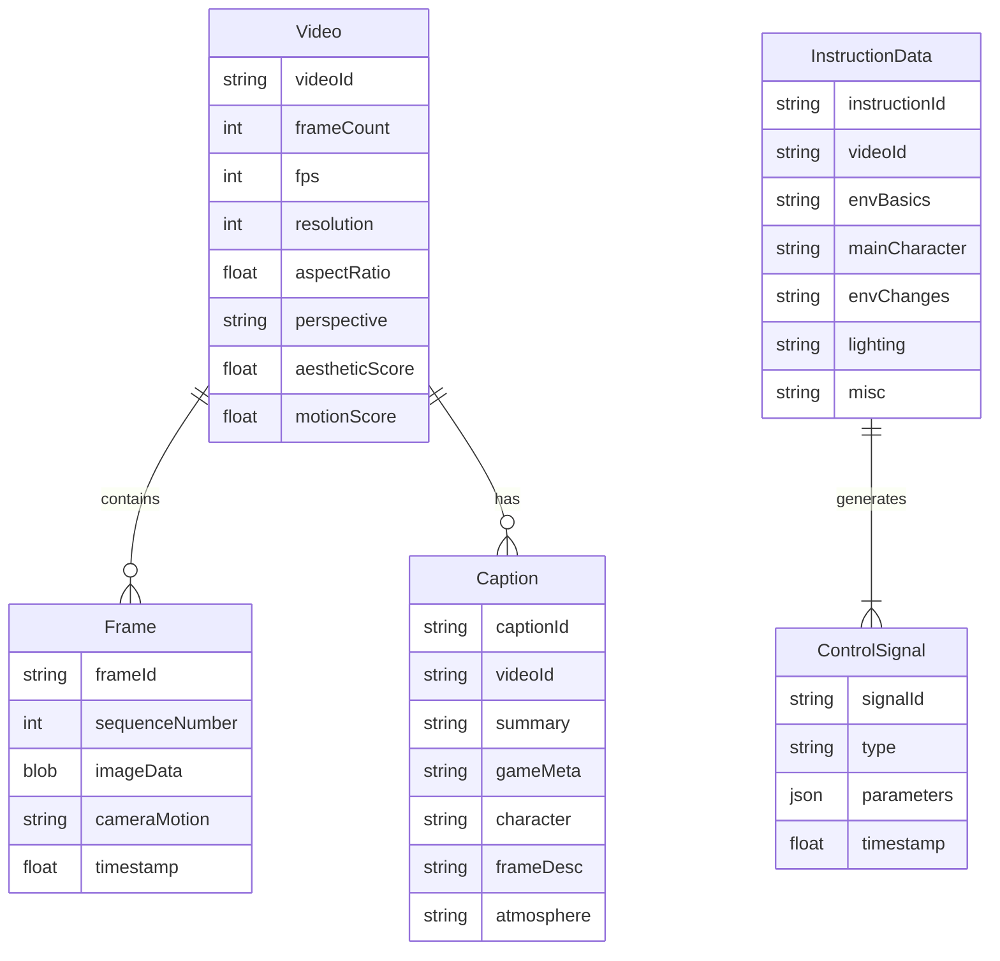
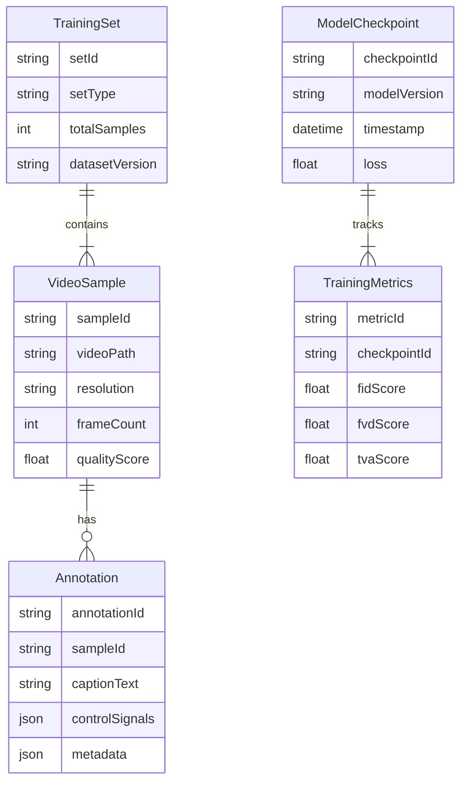
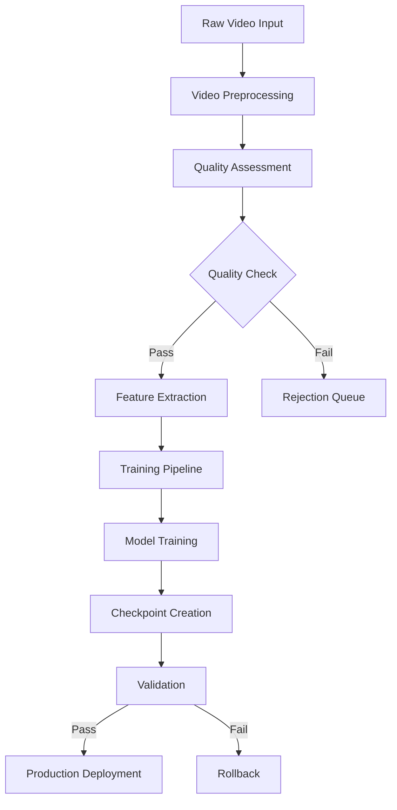
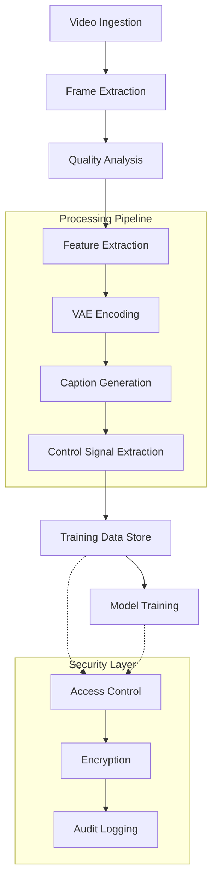

# Product Requirements Document (PRD)

# 1. INTRODUCTION

## 1.1 Purpose

This Software Requirements Specification (SRS) document provides a comprehensive description of the GameGen-X system - an AI-powered video game generation and interactive control model. The document is intended for:

- Development teams implementing the model architecture and training pipeline
- ML engineers working on model optimization and deployment
- Game developers and designers evaluating the system for prototyping workflows
- Researchers building upon or extending the model capabilities
- Project stakeholders assessing technical feasibility and requirements

The SRS aims to establish clear requirements and specifications to guide successful implementation while maintaining alignment with project goals and constraints.

## 1.2 Scope

GameGen-X is a diffusion transformer model designed to generate and interactively control open-world game videos. The system encompasses:

### 1.2.1 Core Functionalities

- Text-to-video generation of game content including characters, environments, actions and events
- Interactive control of generated content through keyboard inputs and text instructions
- Video continuation and modification based on user controls
- Support for both first-person and third-person game perspectives
- Integration with standard game development workflows

### 1.2.2 Key Components

- 3D Spatio-Temporal VAE for video compression
- Masked Spatial-Temporal Diffusion Transformer (MSDiT) for generation
- InstructNet for interactive control
- Training pipeline utilizing OGameData dataset
- Inference optimization for deployment

### 1.2.3 Benefits

- Accelerates game prototyping and concept validation
- Reduces manual effort in early-stage content creation
- Enables rapid iteration on game mechanics and environments
- Provides an interactive platform for testing gameplay ideas
- Serves as a foundation for future game generation research

### 1.2.4 Constraints

- Requires significant GPU compute resources for training
- Limited to 720p resolution for real-time interaction
- Maximum sequence length of 102 frames at 24 FPS
- Focuses on single-player experiences currently
- Outputs are video-based rather than 3D assets

The system aims to demonstrate the potential of generative AI models in game development while establishing a framework for future advances in interactive content generation.

## 1.3 Definitions, Acronyms and Abbreviations

- **VAE**: Variational Autoencoder
- **MSDiT**: Masked Spatial-Temporal Diffusion Transformer  
- **FPS**: Frames Per Second
- **GPU**: Graphics Processing Unit
- **UI**: User Interface
- **PRD**: Product Requirements Document
- **SRS**: Software Requirements Specification
- **API**: Application Programming Interface

## 1.4 References

- GameGen-X Research Paper (arXiv:2411.00769v3)
- OGameData Dataset Documentation
- FastAPI Documentation
- PyTorch Documentation
- NVIDIA CUDA Documentation

## 1.5 Document Overview

The remainder of this SRS document is organized into the following sections:

- Section 2: Overall Description - System context and constraints
- Section 3: Specific Requirements - Detailed functional and non-functional requirements
- Section 4: System Features - Core feature specifications
- Section 5: External Interface Requirements - APIs and integrations
- Section 6: Other Non-functional Requirements - Performance, security etc.
- Section 7: Appendices - Additional technical details and diagrams

# 2. PRODUCT DESCRIPTION

## 2.1 Product Perspective

GameGen-X operates as a standalone AI-powered video game generation and control system, while being designed to potentially integrate with existing game development workflows. The system consists of several key components working together:

- A 3D Spatio-Temporal VAE for efficient video compression and processing
- A Masked Spatial-Temporal Diffusion Transformer (MSDiT) for high-quality video generation
- An InstructNet component for interactive control capabilities
- A FastAPI wrapper for browser-based real-time interaction
- Support for deployment on proprietary hardware using FreeBSD-based Orbis OS

The system is designed to be hardware-agnostic, focusing on CPU and non-NVIDIA GPU architectures to maximize compatibility with the target console platform.

## 2.2 Product Functions

The core functions of GameGen-X include:

### 2.2.1 Content Generation
- Generate high-quality game video content from text descriptions
- Create diverse game environments, characters, and scenarios
- Support both first-person and third-person perspectives
- Generate content at resolutions up to 720p at 24 FPS

### 2.2.2 Interactive Control
- Enable real-time character movement via keyboard inputs
- Allow dynamic environment modification through text instructions
- Support video continuation based on user controls
- Provide multi-modal control through keyboard, text, and video prompts

### 2.2.3 Development Support
- Facilitate rapid game prototyping and concept validation
- Enable quick iteration on gameplay mechanics
- Support testing of game scenarios and environments
- Provide visual feedback for design decisions

## 2.3 User Characteristics

The system is designed for three primary user groups:

### 2.3.1 Game Developers
- Technical expertise: High
- Primary use: Prototyping and testing game concepts
- Needs: Quick iteration, programmatic control, integration capabilities

### 2.3.2 Game Designers
- Technical expertise: Medium
- Primary use: Exploring creative concepts and gameplay ideas
- Needs: Intuitive controls, visual feedback, rapid visualization

### 2.3.3 Researchers
- Technical expertise: High
- Primary use: Extending and studying game generation capabilities
- Needs: Model interpretability, experimental control, documentation

## 2.4 Constraints

### 2.4.1 Technical Constraints
- Maximum video resolution limited to 720p
- Maximum sequence length of 102 frames at 24 FPS
- Real-time generation limited by computational resources
- Non-NVIDIA GPU architecture requirement
- Browser-based interface limitations

### 2.4.2 Performance Constraints
- Generation latency must remain under 100ms for interactive control
- Memory usage limited to available console hardware specifications
- CPU/GPU resource sharing with other system processes

### 2.4.3 Implementation Constraints
- FreeBSD compatibility requirement
- FastAPI integration requirements
- Browser support limitations
- Data storage and processing limitations

## 2.5 Assumptions and Dependencies

### 2.5.1 Assumptions
- Users have access to required computational resources
- Network connectivity available for browser-based interaction
- Basic understanding of game development concepts
- Availability of training data meeting quality requirements

### 2.5.2 Dependencies
- OGameData dataset availability and quality
- FastAPI framework compatibility
- FreeBSD-based Orbis OS support
- Browser WebGL support for rendering
- Sufficient computational resources for deployment

Based on the comprehensive documentation provided, I'll create a process flowchart section that captures the key workflows of the GameGen-X system using Mermaid JS. This will focus on both the generation and interactive control processes.

# 3. PROCESS FLOWCHART

The following flowcharts illustrate the key processes in the GameGen-X system:

## 3.1 Main Generation Pipeline



## 3.2 Interactive Control Flow



## 3.3 Training Pipeline



## 3.4 Data Processing Pipeline



These flowcharts illustrate the main processes in GameGen-X:
- The main generation pipeline showing how text and optional video inputs are processed
- The interactive control flow demonstrating how user inputs modify generated content
- The two-stage training pipeline with foundation model and InstructNet training
- The data processing pipeline used to create the OGameData dataset

Each process is designed to work with the system's core components: the 3D VAE, MSDiT foundation model, and InstructNet, while maintaining consistency with the FreeBSD-based deployment environment and FastAPI wrapper requirements.

Based on the comprehensive documentation provided, I'll break down the functional requirements for GameGen-X into clear features while maintaining consistency with the established technical framework and architecture.

# 4. FUNCTIONAL REQUIREMENTS

## 4.1 Video Generation Features

### 4.1.1 Text-to-Video Generation
**ID**: F-GEN-01  
**Description**: Generate game video content from text descriptions using the MSDiT foundation model  
**Priority**: High  
**Requirements**:
| ID | Requirement | Notes |
|---|---|---|
| F-GEN-01.1 | Accept text prompts up to 300 tokens using T5 encoder | Support for structured game descriptions |
| F-GEN-01.2 | Generate videos at 720p resolution | Maximum supported resolution |
| F-GEN-01.3 | Support 24 FPS output | Standard game framerate |
| F-GEN-01.4 | Generate sequences up to 102 frames | ~4.25 seconds at 24 FPS |
| F-GEN-01.5 | Support both first-person and third-person perspectives | Based on prompt |

### 4.1.2 Video Compression
**ID**: F-COMP-01  
**Description**: Compress and decompress video using 3D Spatio-Temporal VAE  
**Priority**: High  
**Requirements**:
| ID | Requirement | Notes |
|---|---|---|
| F-COMP-01.1 | Reduce spatial dimensions by 8x | For efficient processing |
| F-COMP-01.2 | Reduce temporal dimensions by 4x | For efficient processing |
| F-COMP-01.3 | Maintain visual quality after decompression | Minimize artifacts |
| F-COMP-01.4 | Support real-time compression/decompression | For interactive use |

## 4.2 Interactive Control Features

### 4.2.1 Character Control
**ID**: F-CTRL-01  
**Description**: Enable real-time character control through keyboard inputs  
**Priority**: High  
**Requirements**:
| ID | Requirement | Notes |
|---|---|---|
| F-CTRL-01.1 | Support basic movement controls (WASD) | Standard game controls |
| F-CTRL-01.2 | Process keyboard inputs with <100ms latency | For responsive control |
| F-CTRL-01.3 | Maintain character consistency during movement | Via InstructNet |
| F-CTRL-01.4 | Support smooth animation transitions | For natural movement |

### 4.2.2 Environment Control
**ID**: F-CTRL-02  
**Description**: Allow modification of environment through text instructions  
**Priority**: Medium  
**Requirements**:
| ID | Requirement | Notes |
|---|---|---|
| F-CTRL-02.1 | Support weather/lighting changes | Via instruction fusion |
| F-CTRL-02.2 | Enable terrain/environment modifications | Based on text prompts |
| F-CTRL-02.3 | Maintain scene consistency during changes | Via InstructNet |
| F-CTRL-02.4 | Support gradual transitions | For natural changes |

## 4.3 Video Continuation Features

### 4.3.1 Auto-regressive Generation
**ID**: F-CONT-01  
**Description**: Continue video generation based on previous frames  
**Priority**: High  
**Requirements**:
| ID | Requirement | Notes |
|---|---|---|
| F-CONT-01.1 | Use previous frames as context | Up to 102 frames |
| F-CONT-01.2 | Maintain temporal consistency | Via temporal attention |
| F-CONT-01.3 | Support real-time continuation | For gameplay |
| F-CONT-01.4 | Handle multiple continuation requests | For extended play |

### 4.3.2 Multi-modal Control
**ID**: F-CONT-02  
**Description**: Support multiple types of control inputs for video continuation  
**Priority**: Medium  
**Requirements**:
| ID | Requirement | Notes |
|---|---|---|
| F-CONT-02.1 | Accept keyboard inputs | For character control |
| F-CONT-02.2 | Process text instructions | For environment changes |
| F-CONT-02.3 | Support video prompts | For complex actions |
| F-CONT-02.4 | Enable combined control modes | For rich interaction |

## 4.4 Integration Features

### 4.4.1 FastAPI Integration
**ID**: F-INT-01  
**Description**: Provide web-based interface via FastAPI  
**Priority**: High  
**Requirements**:
| ID | Requirement | Notes |
|---|---|---|
| F-INT-01.1 | Expose REST endpoints | For all core functions |
| F-INT-01.2 | Support WebSocket connections | For real-time control |
| F-INT-01.3 | Handle concurrent requests | For multiple users |
| F-INT-01.4 | Provide error handling | For robustness |

### 4.4.2 Hardware Compatibility
**ID**: F-INT-02  
**Description**: Ensure compatibility with target hardware platform  
**Priority**: High  
**Requirements**:
| ID | Requirement | Notes |
|---|---|---|
| F-INT-02.1 | Support FreeBSD-based Orbis OS | Primary platform |
| F-INT-02.2 | Optimize for non-NVIDIA GPUs | Platform requirement |
| F-INT-02.3 | Manage memory efficiently | Limited resources |
| F-INT-02.4 | Support CPU fallback | For compatibility |

# 5. NON-FUNCTIONAL REQUIREMENTS

## 5.1 Performance Requirements

### 5.1.1 Response Time
- Generation latency must remain under 100ms for interactive control to maintain gameplay fluidity
- Video frame generation must achieve minimum 24 FPS at 720p resolution for smooth playback
- Model inference time should not exceed 50ms per frame on target hardware
- Memory usage must stay within 80GB VRAM limit during inference

### 5.1.2 Throughput
- System must support concurrent generation of up to 4 video streams at 720p resolution
- Batch processing capability of up to 8 requests simultaneously
- Network bandwidth usage not to exceed 100 Mbps per active session
- Support for up to 102 frames per video sequence at 24 FPS

### 5.1.3 Resource Usage
- Maximum GPU memory utilization of 80% during peak load
- CPU utilization not to exceed 60% during normal operation
- Storage I/O limited to 500MB/s for video processing
- Network latency under 20ms for real-time control signals

## 5.2 Safety Requirements

### 5.2.1 System Safety
- Automatic shutdown procedures if hardware temperature exceeds 85°C
- Graceful degradation of service under excessive load
- Automatic recovery from system crashes within 30 seconds
- Regular checkpointing of model states every 1000 iterations

### 5.2.2 Data Safety
- Automated backup of training checkpoints every 4 hours
- Redundant storage of critical model weights and configurations
- Version control for all model configurations and parameters
- Data validation checks before processing user inputs

## 5.3 Security Requirements

### 5.3.1 Authentication & Authorization
- API access restricted through token-based authentication
- Role-based access control for different system functions
- Session timeout after 30 minutes of inactivity
- Maximum 5 failed login attempts before temporary lockout

### 5.3.2 Data Protection
- End-to-end encryption for all network communications using TLS 1.3
- Secure storage of model weights and configurations
- Regular security audits and vulnerability assessments
- Compliance with data privacy regulations

## 5.4 Quality Requirements

### 5.4.1 Availability
- System uptime of 99.9% during operating hours
- Scheduled maintenance windows limited to off-peak hours
- Maximum unplanned downtime of 1 hour per month
- Redundant hardware configuration for critical components

### 5.4.2 Maintainability
- Modular architecture allowing component-level updates
- Comprehensive documentation of all system components
- Automated testing coverage of at least 80%
- Clear version control and change management procedures

### 5.4.3 Usability
- Intuitive FastAPI interface for developers
- Clear error messages and status updates
- Response time feedback for long-running operations
- Comprehensive API documentation and examples

### 5.4.4 Scalability
- Horizontal scaling capability up to 32 GPU nodes
- Support for distributed training across multiple machines
- Dynamic resource allocation based on workload
- Linear performance scaling with additional hardware

### 5.4.5 Reliability
- Mean Time Between Failures (MTBF) of at least 720 hours
- Automatic failover to backup systems within 5 seconds
- Error rate below 0.1% for video generation requests
- Regular system health monitoring and reporting

## 5.5 Compliance Requirements

### 5.5.1 Legal Compliance
- Adherence to open-source licensing requirements
- Compliance with relevant patent regulations
- Documentation of all third-party components and licenses
- Regular legal review of system outputs

### 5.5.2 Technical Standards
- Compatibility with FreeBSD-based Orbis OS
- Adherence to OpenAPI specification standards
- Compliance with GPU compute standards
- Implementation of standard video codecs and formats

### 5.5.3 Documentation
- Comprehensive technical documentation in standard formats
- Regular updates to system documentation
- Clear attribution of all data sources
- Detailed API documentation following OpenAPI standards

### 5.5.4 Environmental
- Power efficiency optimization for GPU usage
- Compliance with energy efficiency standards
- Monitoring and reporting of power consumption
- Implementation of power-saving modes during idle periods

# 6. DATA REQUIREMENTS

## 6.1 Data Models

The GameGen-X system requires several interconnected data models to support video generation and interactive control. The following entity relationship diagrams illustrate the key data structures:

### 6.1.1 Core Data Models



### 6.1.2 Training Data Models



## 6.2 Data Storage Requirements

### 6.2.1 Storage Capacity

- Raw video data: Minimum 100TB scalable storage for training dataset
- Processed frames: 50TB high-performance storage for active training
- Model checkpoints: 10TB redundant storage
- Generated content: 25TB expandable storage with automatic cleanup
- Metadata and annotations: 1TB high-availability database storage

### 6.2.2 Data Retention

- Training datasets: Retained indefinitely with versioning
- Generated content: Retained for 30 days unless explicitly preserved
- Model checkpoints: Latest 5 versions retained, earlier versions archived
- System logs: 90 days online, 1 year in cold storage
- User session data: 7 days for active sessions, 30 days in archives

### 6.2.3 Backup and Recovery

- **Real-time Replication**:
  - Model checkpoints replicated across 3 geographic locations
  - Active training data mirrored to standby systems
  - Metadata databases in active-active configuration

- **Periodic Backups**:
  - Full dataset backup weekly
  - Incremental backups daily
  - Transaction logs backed up hourly
  - Recovery Point Objective (RPO): 1 hour
  - Recovery Time Objective (RTO): 4 hours

## 6.3 Data Processing Requirements

### 6.3.1 Data Flow Architecture



### 6.3.2 Data Security

- **Encryption**:
  - Data at rest: AES-256 encryption
  - Data in transit: TLS 1.3
  - Model weights: Encrypted with hardware security modules

- **Access Control**:
  - Role-based access control (RBAC)
  - Multi-factor authentication for administrative access
  - Audit logging of all data access

- **Data Privacy**:
  - Automated PII detection and redaction
  - Data anonymization for research use
  - Compliance with GDPR and CCPA requirements

### 6.3.3 Data Processing Pipeline



### 6.3.4 Data Quality Requirements

- Video frame quality score > 4.5/6.0
- Caption coherence validation > 90%
- Control signal accuracy > 95%
- Frame temporal consistency > 0.85
- Data completeness checks for all required fields
- Automated validation of data format and structure
- Regular data quality audits and cleanup

### 6.3.5 Data Transformation Rules

- Video resolution standardization to 720p
- Frame rate normalization to 24 FPS
- Color space conversion to RGB
- Temporal downsampling by factor of 4
- Spatial downsampling by factor of 8
- Caption length normalization to 300 tokens
- Control signal standardization to unified format

# 7. EXTERNAL INTERFACES

## 7.1 User Interfaces

### 7.1.1 Web Interface
- Browser-based interface built with FastAPI for real-time interaction
- Responsive design supporting resolutions up to 1920x1080
- Key components:
  - Video display area (720p resolution)
  - Text input field for prompts (300 token limit)
  - Keyboard control overlay
  - Generation settings panel
  - Environment control panel

### 7.1.2 Control Interface
- Keyboard mapping for character control:
  - WASD: Character movement
  - Space: Action execution
  - E: Environment interaction
  - Q: Camera control
- Text instruction panel for:
  - Environment modifications
  - Weather/lighting changes
  - Scene transitions
  - Character behavior

## 7.2 Hardware Interfaces

### 7.2.1 GPU Interface
- Support for non-NVIDIA GPU architectures
- Memory requirements:
  - Minimum 24GB VRAM for inference
  - 80GB VRAM recommended for training
- Hardware-specific optimizations:
  - Dynamic batch sizing
  - Memory-efficient attention mechanisms
  - Gradient checkpointing support

### 7.2.2 Storage Interface
- High-speed SSD requirements:
  - Minimum 500MB/s read speed
  - 1GB/s write speed recommended
  - 50TB storage capacity for training data
  - 10TB for model checkpoints

## 7.3 Software Interfaces

### 7.3.1 Model Components
- 3D VAE Interface:
  - Input: Raw video frames (720p)
  - Output: Compressed latent representations
  - Protocol: PyTorch tensors
  - Compression ratios: 8x spatial, 4x temporal

- MSDiT Interface:
  - Input: Latent codes and text embeddings
  - Output: Generated video latents
  - Protocol: PyTorch tensors
  - Support for batched processing

- InstructNet Interface:
  - Input: Control signals and video latents
  - Output: Modified latent representations
  - Protocol: PyTorch tensors
  - Real-time processing capability

### 7.3.2 External Libraries
- FastAPI: Web server implementation
- PyTorch: Deep learning framework
- T5: Text encoding
- CLIP-AVA: Aesthetic scoring
- UniMatch: Motion filtering
- CoTrackerV2: Camera motion tracking

## 7.4 Communication Interfaces

### 7.4.1 API Endpoints
- REST API endpoints:
  ```
  POST /generate
  - Input: Text prompt, generation parameters
  - Output: Generated video URL
  
  POST /control
  - Input: Control signals, current frame
  - Output: Next frame data
  
  GET /status
  - Output: System status and metrics
  ```

### 7.4.2 WebSocket Interface
- Real-time communication protocol:
  ```
  ws://server/stream
  - Events: Frame updates, control signals
  - Format: Binary video frames
  - Latency: <100ms target
  ```

### 7.4.3 Data Formats
- Video Format:
  - Codec: H.264
  - Container: MP4
  - Resolution: 720p
  - Framerate: 24 FPS
  
- Control Signal Format:
  ```json
  {
    "type": "control",
    "timestamp": "float",
    "keyboard": {
      "keys": ["string"],
      "state": "boolean"
    },
    "instruction": {
      "text": "string",
      "parameters": {}
    }
  }
  ```

### 7.4.4 Network Requirements
- Bandwidth:
  - Minimum: 10 Mbps upload/download
  - Recommended: 50 Mbps
- Latency:
  - Maximum: 100ms round-trip
  - Target: 50ms
- Protocol Support:
  - WebSocket
  - HTTPS
  - TCP/IP

# APPENDICES

## A. GLOSSARY

- **3D Spatio-Temporal VAE**: A specialized variational autoencoder that compresses video data in both spatial and temporal dimensions
- **Auto-regressive Generation**: A sequential generation process where each new frame depends on previously generated frames
- **Bucket Training**: A training strategy that samples videos of different resolutions and durations with specified probabilities
- **Classifier-free Guidance**: A technique that improves generation quality by randomly dropping text inputs during training
- **Cross-attention**: An attention mechanism that aligns video generation with semantic information from text prompts
- **Diffusion Model**: A type of generative model that gradually denoises data to create new samples
- **Foundation Model**: The base model trained for video generation and continuation capabilities
- **InstructNet**: A specialized network designed to enable interactive control over generated content
- **Latent Space**: A compressed representation space where the model performs its operations
- **Masked Spatial-Temporal Diffusion Transformer (MSDiT)**: The core architecture combining spatial and temporal attention for video generation
- **Multi-modal Control**: The ability to accept and process multiple types of input signals (text, keyboard, video prompts)
- **Rectified Flow**: An optimization technique used to accelerate training and enhance generation accuracy
- **Spatial Attention**: Mechanism for processing relationships within individual frames
- **Temporal Attention**: Mechanism for maintaining consistency across video frames

## B. ACRONYMS

- **3D-VAE**: 3D Variational Autoencoder
- **API**: Application Programming Interface
- **BC**: Background Consistency
- **DD**: Dynamic Degrees
- **FID**: Fréchet Inception Distance
- **FPS**: Frames Per Second
- **FVD**: Fréchet Video Distance
- **GPU**: Graphics Processing Unit
- **IQ**: Image Quality
- **MLP**: Multi-Layer Perceptron
- **MS**: Motion Smoothness
- **QK**: Query-Key
- **RoPE**: Rotary Position Embedding
- **SC**: Subject Consistency
- **SR**: Success Rate
- **SR-C**: Success Rate for Character Actions
- **SR-E**: Success Rate for Environment Events
- **TVA**: Text-Video Alignment
- **UP**: User Preference

## C. ADDITIONAL REFERENCES

### Academic Papers
- "Denoising Diffusion Probabilistic Models" (Ho et al., 2020)
- "Score-based Generative Modeling through Stochastic Differential Equations" (Song et al., 2020)
- "High-Resolution Image Synthesis with Latent Diffusion Models" (Rombach et al., 2022)
- "Classifier-Free Diffusion Guidance" (Ho & Salimans, 2021)
- "Flow Straight and Fast: Learning to Generate and Transfer Data with Rectified Flow" (Liu et al., 2023)

### Technical Documentation
- NVIDIA CUDA Programming Guide
- PyTorch Distributed Training Documentation
- FreeBSD System Architecture Guide
- T5 Model Documentation
- FastAPI WebSocket Documentation

### Development Resources
- Game Engine Development Guidelines
- Video Compression Standards Documentation
- Real-time Rendering Best Practices
- Distributed Systems Design Patterns
- Interactive Systems Design Guidelines

## D. TRAINING INFRASTRUCTURE

### Hardware Requirements
- 24x NVIDIA H800 GPUs (80GB VRAM each)
- Distributed across 3 servers (8 GPUs per server)
- 50TB high-performance storage
- High-bandwidth inter-node networking

### Software Stack
- PyTorch with distributed training support
- CUDA 12.1
- Zero-2 optimization
- FastAPI for web interface
- FreeBSD-based Orbis OS

### Training Parameters
- Learning rate: 5e-4
- Training epochs: 20
- Text drop rate: 25%
- Batch size: Variable based on resolution
- Mixed precision training enabled

## E. PERFORMANCE METRICS

### Generation Speed
- 320x256 @ 10 steps: ~5.1s/sample (20 FPS)
- 848x480 @ 30 steps: ~44.1s/sample (2.31 FPS)
- 1280x720 @ 50 steps: ~160.1s/sample (0.64 FPS)

### Quality Metrics Targets
- FID score < 300
- FVD score < 1000
- TVA score > 0.8
- Success Rate > 50%
- Motion Smoothness > 0.9
- Subject Consistency > 0.9

These appendices provide additional context and reference material to support the implementation and deployment of the GameGen-X system. The information is organized to facilitate easy access and understanding for different stakeholders involved in the project.