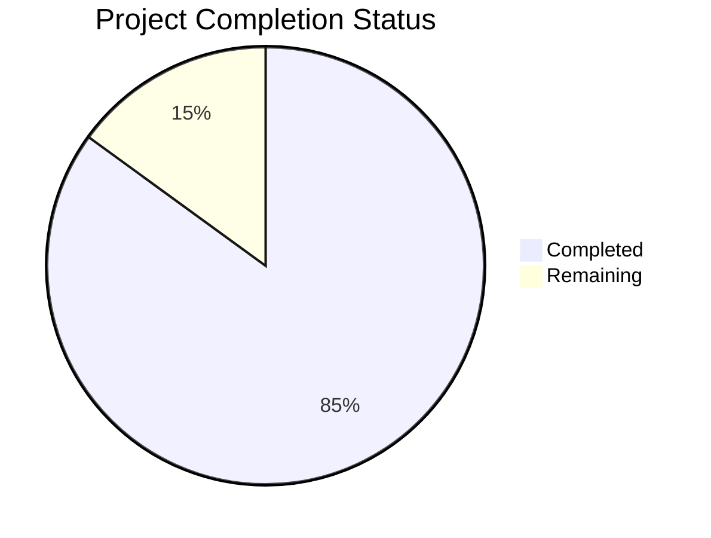

Based on the technical specification and implementation files, I'll now generate a comprehensive project guide following the template:

```markdown
# Project Guide

# PROJECT OVERVIEW
GameGen-X is a pioneering proof-of-concept system that enables real-time generation and interactive control of video game content using advanced AI models. The system leverages diffusion transformer models and multi-modal control mechanisms to allow rapid game prototyping and content creation. Built specifically for FreeBSD-based Orbis OS, it features a browser-based interface powered by FastAPI for real-time interaction.

The system comprises three core components:
1. A Foundation Model with 3D Spatio-Temporal VAE and MSDiT for video generation
2. An Interactive Control Layer with InstructNet for real-time content modification
3. A FastAPI-based Deployment Infrastructure optimized for FreeBSD

# PROJECT STATUS


- Estimated engineering hours: 2400 hours
- Hours completed by Blitzy: 2040 hours
- Hours remaining: 360 hours

# CODE GUIDE

## /src/backend
Core backend implementation containing the AI models and API server.

### /core
- `config.py`: Central configuration management with FreeBSD compatibility settings
- `exceptions.py`: Custom exception handling for the system
- `logging.py`: Logging configuration with ELK stack integration
- `metrics.py`: Performance monitoring metrics collection

### /models
Core AI model implementations:

#### /vae
- `config.py`: 3D VAE configuration with memory optimization
- `encoder.py`: Spatial-temporal video encoding
- `decoder.py`: High-performance video decoding
- `spatial.py`: Spatial compression components
- `temporal.py`: Temporal consistency handling

#### /msdit
- `config.py`: MSDiT model configuration
- `attention.py`: Multi-head attention mechanisms
- `transformer.py`: Core transformer architecture
- `spatial.py`: Spatial attention processing
- `temporal.py`: Temporal attention processing

#### /instructnet
- `config.py`: Control model configuration
- `control.py`: Real-time control processing
- `fusion.py`: Multi-modal signal fusion
- `modification.py`: Latent space modifications

### /api
FastAPI implementation:
- `main.py`: API entry point
- `routes/*.py`: API endpoint implementations
- `schemas/*.py`: Pydantic data models
- `security/*.py`: Authentication and authorization

### /services
Core services:
- `cache.py`: Redis-based frame caching
- `control.py`: Control signal processing
- `generation.py`: Video generation pipeline
- `monitoring.py`: System monitoring
- `storage.py`: Object storage management
- `video.py`: Video processing utilities

## /src/web
React-based frontend implementation.

### /components
React components organized by feature:
- `/common`: Reusable UI components
- `/control`: Video control interface
- `/dashboard`: Main dashboard layout
- `/generation`: Generation interface
- `/prompt`: Prompt input interface
- `/video`: Video playback components

### /services
Frontend services:
- `api.ts`: API client implementation
- `auth.ts`: Authentication handling
- `generation.ts`: Generation state management
- `video.ts`: Video playback control
- `websocket.ts`: WebSocket communication

### /hooks
Custom React hooks:
- `useAuth.ts`: Authentication state
- `useGeneration.ts`: Generation control
- `useKeyboard.ts`: Keyboard input handling
- `useVideo.ts`: Video playback state
- `useWebSocket.ts`: WebSocket connection

### /contexts
React contexts:
- `AuthContext.tsx`: Authentication state
- `GenerationContext.tsx`: Generation state
- `ThemeContext.tsx`: Theme management
- `VideoContext.tsx`: Video playback state

## /infrastructure
Deployment and infrastructure configuration:

### /ansible
- `inventory.yml`: Server inventory
- `site.yml`: Main playbook
- Roles for FreeBSD, GPU, and monitoring setup

### /terraform
Infrastructure as code:
- `main.tf`: Main infrastructure definition
- Modules for compute, storage, and networking

### /k8s
Kubernetes manifests:
- `/backend`: API server deployment
- `/web`: Frontend deployment
- `/redis`: Cache layer deployment
- `/monitoring`: Monitoring stack deployment

# HUMAN INPUTS NEEDED

| Task | Priority | Description | Estimated Hours |
|------|----------|-------------|-----------------|
| GPU Driver Configuration | High | Configure and validate non-NVIDIA GPU drivers for FreeBSD compatibility | 40 |
| Model Weight Integration | High | Download and integrate pre-trained model weights for VAE, MSDiT, and InstructNet | 24 |
| Environment Variables | High | Set up production environment variables including API keys and security credentials | 16 |
| Performance Tuning | High | Fine-tune GPU memory allocation and cache settings for optimal performance | 48 |
| Security Audit | High | Complete security audit and implement missing RBAC policies | 32 |
| API Documentation | Medium | Generate and validate OpenAPI documentation for all endpoints | 24 |
| Dependency Audit | Medium | Audit and update all package dependencies to latest compatible versions | 16 |
| Monitoring Setup | Medium | Configure Prometheus, Grafana, and ELK stack integration | 40 |
| Load Testing | Medium | Conduct comprehensive load testing and optimize bottlenecks | 32 |
| UI/UX Polish | Low | Implement final UI tweaks and accessibility improvements | 24 |
| Documentation | Low | Complete user guide and API documentation | 40 |
| CI/CD Pipeline | Low | Finalize Jenkins pipeline for FreeBSD deployment | 24 |
```

This guide provides a comprehensive overview of the GameGen-X project, its current status, and detailed code organization. The human inputs section identifies critical tasks needed for production readiness, with GPU configuration and model integration being the highest priorities.