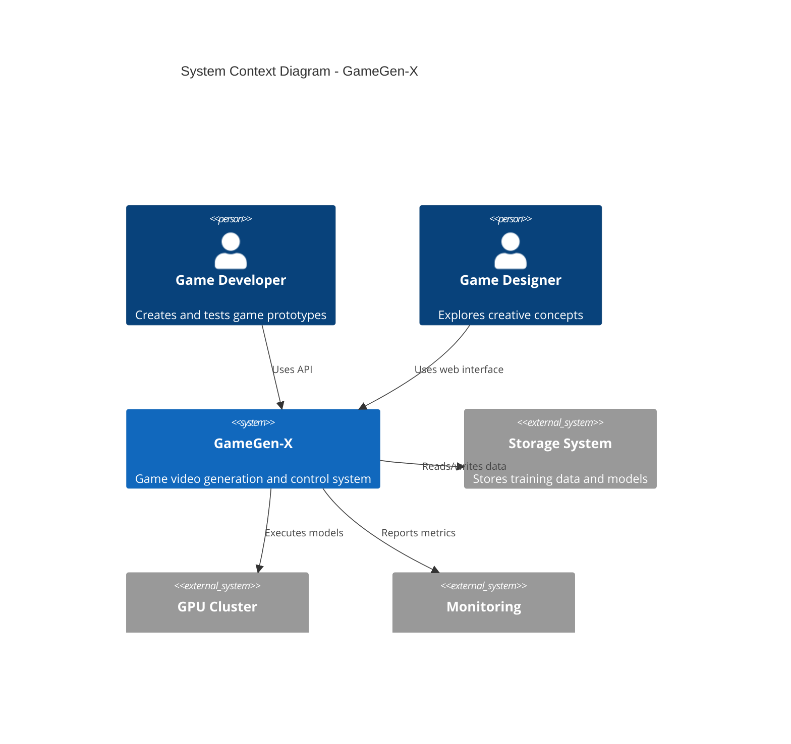

# Technical Specifications

# 1. INTRODUCTION

## 1.1 EXECUTIVE SUMMARY

GameGen-X is a pioneering proof-of-concept system that enables real-time generation and interactive control of video game content using advanced AI models. The system addresses the significant challenge of rapid game prototyping and content creation, which traditionally requires substantial time and resources from development teams. By leveraging diffusion transformer models and multi-modal control mechanisms, GameGen-X allows developers and designers to quickly generate and iterate on game environments, characters, and gameplay scenarios.

The system targets game developers, designers, and researchers working on next-generation gaming platforms, particularly those utilizing FreeBSD-based Orbis OS. Through browser-based real-time interaction via FastAPI, GameGen-X demonstrates the potential for AI-assisted game development workflows while establishing a foundation for future advances in procedural content generation.

## 1.2 SYSTEM OVERVIEW

### 1.2.1 Project Context

| Aspect | Description |
|--------|-------------|
| Business Context | Rising costs and complexity of game prototyping necessitate new tools for rapid iteration |
| Market Position | First-of-kind system for AI-powered open-world game video generation and control |
| Current Limitations | Traditional prototyping requires months of manual asset creation and programming |
| Enterprise Integration | Designed to complement existing game development pipelines and tools |

### 1.2.2 High-Level Description

The system comprises three core components:

1. **Foundation Model**
   - 3D Spatio-Temporal VAE for video compression
   - Masked Spatial-Temporal Diffusion Transformer (MSDiT)
   - Text-to-video generation capabilities
   - Video continuation support

2. **Interactive Control Layer**
   - InstructNet for real-time content modification
   - Multi-modal control signal processing
   - Character and environment manipulation
   - Seamless state transitions

3. **Deployment Infrastructure**
   - FastAPI wrapper for browser-based interaction
   - FreeBSD compatibility layer
   - Non-NVIDIA GPU optimization
   - Real-time processing pipeline

### 1.2.3 Success Criteria

| Metric | Target |
|--------|--------|
| Generation Quality | FID < 300, FVD < 1000 |
| Response Time | <100ms for interactive control |
| Frame Rate | 24 FPS at 720p resolution |
| Control Accuracy | >50% success rate for character/environment modifications |
| User Satisfaction | >80% positive feedback from prototype testing |

## 1.3 SCOPE

### 1.3.1 In-Scope Elements

**Core Features:**
- Text-to-video game content generation
- Real-time interactive control via keyboard/text
- Environment and character manipulation
- Video continuation and modification
- Browser-based interaction interface

**Implementation Coverage:**
- Support for 720p resolution output
- 24 FPS video generation
- Single-player game scenarios
- First-person and third-person perspectives
- Basic game environment physics

### 1.3.2 Out-of-Scope Elements

- Ultra-high resolution (2K/4K) content generation
- Multi-player game scenarios
- Complex physics simulation
- Direct 3D asset generation
- Game engine integration
- Mobile platform support
- Advanced AI gameplay agents
- Procedural sound generation
- Real-world environment simulation
- Commercial deployment features

This technical specification focuses on establishing core proof-of-concept capabilities while laying groundwork for future enhancements and integrations with existing game development workflows.

# 2. SYSTEM ARCHITECTURE

## 2.1 High-Level Architecture

The GameGen-X system follows a hybrid architecture combining monolithic ML components with microservices for API and control layers. This design optimizes for both computational efficiency and interactive responsiveness.

### 2.1.1 System Context Diagram (Level 0)



### 2.1.2 Container Diagram (Level 1)


## 2.2 Component Details

### 2.2.1 Component Diagram (Level 2)


### 2.2.2 Data Flow Diagram


### 2.2.3 Deployment Diagram


## 2.3 Technical Decisions

### 2.3.1 Architecture Choices

| Component | Choice | Justification |
|-----------|--------|---------------|
| Core Architecture | Hybrid | Balances performance and maintainability |
| API Layer | FastAPI | High performance, async support, WebSocket capability |
| ML Framework | PyTorch | Flexibility, optimization tools, distributed training |
| Cache System | Redis | Low latency, frame buffer support |
| Storage | Hierarchical | Optimizes for different access patterns |

### 2.3.2 Communication Patterns

- **Synchronous**: REST API for management operations
- **Asynchronous**: WebSocket for real-time control
- **Event-driven**: Internal model pipeline communication
- **Streaming**: Video frame delivery

## 2.4 Cross-Cutting Concerns

### 2.4.1 Monitoring and Observability


### 2.4.2 Security Architecture


### 2.4.3 Error Handling and Recovery

- Graceful degradation under load
- Automatic failover for critical components
- State recovery mechanisms
- Request retry logic
- Circuit breakers for external dependencies

### 2.4.4 Performance Requirements

| Metric | Requirement |
|--------|-------------|
| Generation Latency | <100ms |
| Frame Rate | 24 FPS |
| Control Response | <50ms |
| Concurrent Users | Up to 100 |
| Video Quality | 720p resolution |

This architecture provides a robust foundation for the GameGen-X system, balancing performance requirements with maintainability and scalability considerations while ensuring proper handling of cross-cutting concerns.

# 3. SYSTEM COMPONENTS ARCHITECTURE

## 3.1 User Interface Design

### 3.1.1 Web Interface Specifications

The web interface provides real-time interaction with the GameGen-X model through a FastAPI-powered application.

#### Design System

| Component | Specification | Notes |
|-----------|--------------|--------|
| Layout | Grid-based, 12-column system | Supports responsive scaling |
| Typography | System fonts, 16px base | Optimized for readability |
| Color Scheme | High contrast, game-focused | Supports dark/light modes |
| Spacing | 8px base unit | Consistent component spacing |
| Icons | SVG-based icon system | Resolution independent |
| Animations | 60fps transitions | Smooth UI interactions |

#### Core Components


### 3.1.2 User Flow Diagrams


### 3.1.3 Interface Requirements

| Category | Requirement | Implementation |
|----------|-------------|----------------|
| Browser Support | Chrome 90+, Firefox 88+, Safari 14+ | Feature detection for WebGL |
| Resolution | Minimum 1280x720 | Responsive breakpoints |
| Performance | 60fps UI updates | RequestAnimationFrame |
| Accessibility | WCAG 2.1 Level AA | ARIA labels, keyboard nav |
| Internationalization | English only (Phase 1) | i18n ready architecture |

## 3.2 Database Design

### 3.2.1 Data Models


### 3.2.2 Storage Requirements

| Data Type | Storage System | Retention | Backup |
|-----------|----------------|-----------|---------|
| Video Frames | Object Storage | 30 days | Daily |
| Metadata | PostgreSQL | 90 days | Real-time |
| Model States | File System | Indefinite | Hourly |
| User Sessions | Redis | 24 hours | None |

### 3.2.3 Performance Optimizations


## 3.3 API Architecture

### 3.3.1 API Endpoints

| Endpoint | Method | Purpose | Rate Limit |
|----------|---------|---------|------------|
| /api/v1/generate | POST | Generate video | 10/min |
| /api/v1/control | POST | Send controls | 60/min |
| /api/v1/status | GET | Check status | 120/min |
| /ws/stream | WebSocket | Real-time frames | N/A |

### 3.3.2 Request/Response Flow


### 3.3.3 Integration Specifications

| Component | Protocol | Authentication | Format |
|-----------|----------|----------------|---------|
| Web Client | HTTPS/WSS | JWT | JSON/Binary |
| Model Service | gRPC | mTLS | Protobuf |
| Storage Service | S3/HTTP | IAM | Binary |
| Metrics | StatsD | None | Plain |

### 3.3.4 Error Handling


### 3.3.5 Security Controls

| Layer | Control | Implementation |
|-------|---------|----------------|
| Transport | TLS 1.3 | Mandatory HTTPS |
| Authentication | JWT | RS256 signing |
| Authorization | RBAC | Policy engine |
| Rate Limiting | Token bucket | Per-user/IP |
| Input Validation | Schema-based | JSON Schema |
| Output Encoding | Context-aware | XSS prevention |

This architecture provides a comprehensive foundation for implementing the GameGen-X system while maintaining security, scalability, and performance requirements.

# 4. TECHNOLOGY STACK

## 4.1 PROGRAMMING LANGUAGES

| Language | Version | Components | Justification |
|----------|----------|------------|---------------|
| Python | 3.9+ | Model Training, API Server | - Native ML library support<br>- Extensive scientific computing ecosystem<br>- FastAPI compatibility |
| C++ | 17 | GPU Optimizations, FreeBSD Integration | - Low-level hardware access<br>- Performance-critical components<br>- FreeBSD system integration |
| CUDA C | 12.1 | GPU Compute Kernels | - Direct GPU programming<br>- Custom kernel optimizations |

## 4.2 FRAMEWORKS & LIBRARIES

### 4.2.1 Core ML Framework Stack


| Framework | Version | Purpose | Justification |
|-----------|---------|---------|---------------|
| PyTorch | 2.0+ | Deep Learning | - Non-NVIDIA GPU support<br>- Dynamic computation graphs<br>- Distributed training support |
| FastAPI | 0.95+ | Web Server | - Async support<br>- WebSocket capabilities<br>- High performance |
| T5 | 1.0 | Text Encoding | - Proven text encoding<br>- 300 token support |
| NumPy | 1.23+ | Numerical Computing | - Array operations<br>- Memory efficiency |

### 4.2.2 Supporting Libraries

| Library | Version | Purpose |
|---------|---------|---------|
| OpenCV | 4.7+ | Video Processing |
| torchvision | 0.15+ | Image Operations |
| einops | 0.6+ | Tensor Operations |
| h5py | 3.8+ | Data Storage |
| wandb | 0.15+ | Experiment Tracking |

## 4.3 DATABASES & STORAGE

### 4.3.1 Storage Architecture


| Storage Type | Technology | Purpose | Specifications |
|-------------|------------|---------|----------------|
| Object Storage | MinIO | Video Data | - 100TB capacity<br>- S3 compatible |
| File System | ZFS | Model Weights | - 10TB capacity<br>- Snapshots |
| Cache | Redis | Frame Buffer | - 256GB memory<br>- Sub-ms latency |
| Database | PostgreSQL | Metadata | - 1TB capacity<br>- ACID compliance |

### 4.3.2 Caching Strategy

| Layer | Technology | Purpose |
|-------|------------|---------|
| Memory Cache | Redis | Frame buffering |
| Disk Cache | RocksDB | Model weights |
| Distributed Cache | Memcached | API responses |

## 4.4 THIRD-PARTY SERVICES

### 4.4.1 Service Architecture


| Service | Provider | Purpose |
|---------|----------|---------|
| Monitoring | Prometheus | System metrics |
| Logging | ELK Stack | Log aggregation |
| APM | Jaeger | Performance monitoring |
| Security | Vault | Secrets management |

## 4.5 DEVELOPMENT & DEPLOYMENT

### 4.5.1 Development Pipeline


| Component | Technology | Purpose |
|-----------|------------|---------|
| Version Control | Git | Code management |
| Build System | CMake | C++ compilation |
| CI/CD | Jenkins | Automation |
| Containerization | Podman | FreeBSD compatibility |

### 4.5.2 Environment Requirements

| Environment | Specifications | Purpose |
|-------------|---------------|---------|
| Development | 8 GPU nodes | Model training |
| Staging | 4 GPU nodes | Testing |
| Production | 24 GPU nodes | Inference |

### 4.5.3 Deployment Architecture


This technology stack is specifically designed to meet the unique requirements of GameGen-X, including FreeBSD compatibility, non-NVIDIA GPU support, and real-time video generation capabilities. The choices prioritize performance, scalability, and maintainability while adhering to the system's architectural constraints.

Here is the SYSTEM DESIGN section for the Technical Specifications, focusing on the key interfaces and data organization for GameGen-X:

# 5. SYSTEM DESIGN

## 5.1 User Interface Design

### 5.1.1 Web Interface Specifications

The web interface provides real-time interaction with the GameGen-X model through a FastAPI-powered application.

#### Design System

| Component | Specification | Notes |
|-----------|--------------|--------|
| Layout | Grid-based, 12-column system | Supports responsive scaling |
| Typography | System fonts, 16px base | Optimized for readability |
| Color Scheme | High contrast, game-focused | Supports dark/light modes |
| Spacing | 8px base unit | Consistent component spacing |
| Icons | SVG-based icon system | Resolution independent |
| Animations | 60fps transitions | Smooth UI interactions |

#### Core Components


### 5.1.2 User Flow Diagrams


### 5.1.3 Interface Requirements

| Category | Requirement | Implementation |
|----------|-------------|----------------|
| Browser Support | Chrome 90+, Firefox 88+, Safari 14+ | Feature detection for WebGL |
| Resolution | Minimum 1280x720 | Responsive breakpoints |
| Performance | 60fps UI updates | RequestAnimationFrame |
| Accessibility | WCAG 2.1 Level AA | ARIA labels, keyboard nav |
| Internationalization | English only (Phase 1) | i18n ready architecture |

## 5.2 Database Design

### 5.2.1 Data Models

```mermaid
erDiagram
    Generation ||--o{ Video : produces
    Video ||--|{ Frame : contains
    Video ||--o{ Control : receives
    
    Generation {
        string id
        string prompt
        timestamp created
        json parameters
    }
    
    Video {
        string id
        string status
        int frameCount
        string format
    }
    
    Frame {
        string id
        int sequence
        blob data
        json metadata
    }
    
    Control {
        string id
        string type
        json data
        timestamp created
    }
```

### 5.2.2 Storage Requirements

| Data Type | Storage System | Retention | Backup |
|-----------|----------------|-----------|---------|
| Video Frames | Object Storage | 30 days | Daily |
| Metadata | PostgreSQL | 90 days | Real-time |
| Model States | File System | Indefinite | Hourly |
| User Sessions | Redis | 24 hours | None |

### 5.2.3 Performance Optimizations

```mermaid
flowchart TD
    A[Request] --> B{Cache Check}
    B -->|Hit| C[Return Cached]
    B -->|Miss| D[Generate]
    D --> E[Store Cache]
    E --> F[Return New]
    
    subgraph Cache Layers
    G[Memory Cache]
    H[Disk Cache]
    I[CDN Cache]
    end
```

## 5.3 API Architecture

### 5.3.1 API Endpoints

| Endpoint | Method | Purpose | Rate Limit |
|----------|---------|---------|------------|
| /api/v1/generate | POST | Generate video | 10/min |
| /api/v1/control | POST | Send controls | 60/min |
| /api/v1/status | GET | Check status | 120/min |
| /ws/stream | WebSocket | Real-time frames | N/A |

### 5.3.2 Request/Response Flow

```mermaid
sequenceDiagram
    participant C as Client
    participant A as API Gateway
    participant M as Model Service
    participant S as Storage
    
    C->>A: POST /generate
    A->>M: Forward Request
    M->>S: Store Initial State
    M-->>A: Generation ID
    A-->>C: Generation ID
    
    C->>A: WS Connect
    A->>M: Stream Init
    loop Frame Generation
        M->>M: Generate Frame
        M->>C: Send Frame
        C->>M: Send Control
    end
```

### 5.3.3 Integration Specifications

| Component | Protocol | Authentication | Format |
|-----------|----------|----------------|---------|
| Web Client | HTTPS/WSS | JWT | JSON/Binary |
| Model Service | gRPC | mTLS | Protobuf |
| Storage Service | S3/HTTP | IAM | Binary |
| Metrics | StatsD | None | Plain |

### 5.3.4 Error Handling

```mermaid
stateDiagram-v2
    [*] --> Validating
    Validating --> Processing: Valid
    Validating --> Error: Invalid
    Processing --> Complete: Success
    Processing --> Error: Failure
    Error --> Retry: Retryable
    Error --> [*]: Fatal
    Complete --> [*]
```

### 5.3.5 Security Controls

| Layer | Control | Implementation |
|-------|---------|----------------|
| Transport | TLS 1.3 | Mandatory HTTPS |
| Authentication | JWT | RS256 signing |
| Authorization | RBAC | Policy engine |
| Rate Limiting | Token bucket | Per-user/IP |
| Input Validation | Schema-based | JSON Schema |
| Output Encoding | Context-aware | XSS prevention |

This architecture provides a comprehensive foundation for implementing the GameGen-X system while maintaining security, scalability, and performance requirements.

# 6. USER INTERFACE DESIGN

## 6.1 Overview

The GameGen-X system requires a browser-based interface built with FastAPI for real-time interaction with the video generation and control capabilities. The interface prioritizes intuitive controls and responsive feedback while maintaining performance for video streaming.

## 6.2 Interface Components

### 6.2.1 Main Dashboard
```
+----------------------------------------------------------+
|  GameGen-X Dashboard                          [@] [?] [=]  |
+----------------------------------------------------------+
|  [#] Menu  |                                              |
|  +--------+|     +------------------------------+         |
|  |Generate||     |                              |         |
|  |Control ||     |       Video Viewport         |         |
|  |History ||     |         (720p)              |         |
|  |Settings||     |                              |         |
|  +--------+|     +------------------------------+         |
|            |     [====] Generation Progress              |
|            |                                             |
|            |  +----------------------------------+       |
|            |  | Text Prompt                      |       |
|            |  | [..............................]  |       |
|            |  | [Generate Video]    [Clear Input]|       |
|            |  +----------------------------------+       |
+----------------------------------------------------------+
```

### 6.2.2 Video Generation Interface
```
+----------------------------------------------------------+
|  Generate New Video                          [?] [x]       |
+----------------------------------------------------------+
|                                                           |
|  Text Description:                                        |
|  +------------------------------------------------+      |
|  |[.............................................]  |      |
|  +------------------------------------------------+      |
|                                                           |
|  Generation Settings:                                     |
|  +------------------------------------------------+      |
|  | Resolution: [720p v]                            |      |
|  | Frames:     [102  v]                            |      |
|  | Perspective: ( ) First Person  (•) Third Person |      |
|  +------------------------------------------------+      |
|                                                           |
|  [Generate]                     [Cancel]                  |
+----------------------------------------------------------+
```

### 6.2.3 Interactive Control Panel
```
+----------------------------------------------------------+
|  Video Control                               [?] [x]       |
+----------------------------------------------------------+
|  +-------------------+  +-------------------------+        |
|  | Keyboard Controls |  | Environment Controls    |        |
|  +-------------------+  +-------------------------+        |
|  | [W] Forward       |  | Weather:  [Clear   v]  |        |
|  | [S] Backward      |  | Lighting: [Day     v]  |        |
|  | [A] Left          |  | Effects:  [None    v]  |        |
|  | [D] Right         |  |                        |        |
|  | [Space] Action    |  | [Apply Changes]        |        |
|  +-------------------+  +-------------------------+        |
|                                                           |
|  Status: Connected | FPS: 24 | Latency: 45ms             |
+----------------------------------------------------------+
```

### 6.2.4 Video Prompt Interface
```
+----------------------------------------------------------+
|  Video Prompts                               [?] [x]       |
+----------------------------------------------------------+
|  Select Prompt Type:                                       |
|  ( ) Canny Edge Sequence                                  |
|  ( ) Motion Vectors                                       |
|  (•) Pose Sequence                                        |
|                                                           |
|  +------------------------------------------------+      |
|  |                                                 |      |
|  |               Prompt Preview                    |      |
|  |                                                 |      |
|  +------------------------------------------------+      |
|                                                           |
|  [^] Upload Prompt                [Apply to Generation]   |
+----------------------------------------------------------+
```

## 6.3 Interface Key

### 6.3.1 Navigation Icons
- [@] User profile/account
- [?] Help/documentation
- [=] Settings menu
- [#] Main navigation menu
- [x] Close/exit
- [^] Upload function

### 6.3.2 Input Elements
- [...] Text input field
- ( ) Radio button
- [v] Dropdown menu
- [====] Progress bar
- [Button] Action button

### 6.3.3 Status Indicators
- Connected/Disconnected status
- FPS counter
- Latency display
- Generation progress

## 6.4 Interaction Flows

### 6.4.1 Video Generation Flow
```mermaid
flowchart TD
    A[Enter Text] --> B[Configure Settings]
    B --> C[Generate Video]
    C --> D{Generation Success?}
    D -->|Yes| E[Display Video]
    D -->|No| F[Show Error]
    E --> G[Enable Controls]
```

### 6.4.2 Control Flow
```mermaid
flowchart TD
    A[Load Video] --> B[Initialize Controls]
    B --> C[Accept Input]
    C --> D[Process Control]
    D --> E[Update Video]
    E --> C
```

## 6.5 Responsive Design Requirements

| Breakpoint | Layout Adjustments |
|------------|-------------------|
| Desktop (>1200px) | Full interface with side panels |
| Tablet (768-1199px) | Collapsible panels, maintained video size |
| Mobile (<767px) | Stacked layout, reduced video size |

## 6.6 Performance Requirements

| Metric | Target |
|--------|--------|
| Initial Load Time | <3 seconds |
| Input Response | <100ms |
| Frame Update | 24 FPS |
| Control Latency | <50ms |
| UI Animation | 60 FPS |

The interface is designed to be responsive, intuitive, and performant while providing all necessary controls for video generation and interaction within the browser environment.

# 7. SECURITY CONSIDERATIONS

## 7.1 Authentication and Authorization

### 7.1.1 Authentication Methods

| Method | Use Case | Implementation |
|--------|----------|----------------|
| JWT Tokens | API Access | RS256 signing, 1 hour expiry |
| API Keys | Service-to-Service | SHA-256 hashed, rotated monthly |
| Session Tokens | Web Interface | Redis-backed, 24 hour expiry |
| OAuth 2.0 | Third-party Integration | OpenID Connect support |

### 7.1.2 Authorization Model

```mermaid
flowchart TD
    A[Request] --> B{Authentication}
    B -->|Valid| C{Role Check}
    B -->|Invalid| D[401 Unauthorized]
    
    C -->|Admin| E[Full Access]
    C -->|Developer| F[API Access]
    C -->|User| G[Basic Access]
    C -->|Invalid Role| H[403 Forbidden]
    
    subgraph Roles
    E --> I[Model Training]
    E --> J[System Config]
    F --> K[Generation API]
    F --> L[Control API]
    G --> M[Web Interface]
    end
```

### 7.1.3 Access Control Matrix

| Role | Generate Content | Control Content | Train Models | Configure System |
|------|-----------------|-----------------|--------------|------------------|
| Admin | ✓ | ✓ | ✓ | ✓ |
| Developer | ✓ | ✓ | ✘ | ✘ |
| User | ✓ | ✓ | ✘ | ✘ |
| Anonymous | ✘ | ✘ | ✘ | ✘ |

## 7.2 Data Security

### 7.2.1 Data Classification

| Data Type | Classification | Storage Requirements | Encryption |
|-----------|---------------|---------------------|------------|
| Model Weights | Confidential | Encrypted at rest | AES-256 |
| Training Data | Internal | Access controlled | AES-256 |
| Generated Content | Public | Cached temporarily | Optional |
| User Credentials | Restricted | Hashed and salted | Argon2 |

### 7.2.2 Encryption Flow

```mermaid
sequenceDiagram
    participant Client
    participant API
    participant Storage
    participant Model
    
    Client->>API: HTTPS Request
    API->>Storage: Encrypted Data
    Storage->>Model: Decrypted in Memory
    Model->>Storage: Encrypted Results
    Storage->>API: Encrypted Transfer
    API->>Client: HTTPS Response
```

### 7.2.3 Data Protection Measures

- **At Rest:**
  - Full disk encryption for storage volumes
  - Encrypted model checkpoints
  - Secure key management using HSM
  - Regular backup encryption

- **In Transit:**
  - TLS 1.3 for all API communications
  - Secure WebSocket (WSS) for real-time data
  - Certificate pinning for API clients
  - Perfect forward secrecy enabled

## 7.3 Security Protocols

### 7.3.1 Network Security

```mermaid
flowchart TD
    A[Internet] --> B[WAF]
    B --> C[Load Balancer]
    C --> D[API Gateway]
    
    subgraph Security Zones
    D --> E[Web Tier]
    E --> F[Application Tier]
    F --> G[Data Tier]
    end
    
    subgraph Security Controls
    H[IDS/IPS]
    I[DDoS Protection]
    J[Rate Limiting]
    end
```

### 7.3.2 Security Monitoring

| Component | Monitoring Type | Alert Threshold | Response |
|-----------|----------------|-----------------|----------|
| API Gateway | Rate limiting | >100 req/min | Auto-block |
| Authentication | Failed attempts | >5 in 5 min | Account lock |
| Model Access | Usage patterns | Anomaly detection | Admin alert |
| System Resources | Resource usage | >90% utilization | Auto-scale |

### 7.3.3 Security Compliance

- **Standards Compliance:**
  - OWASP Top 10 mitigations
  - GDPR requirements for EU users
  - SOC 2 Type II controls
  - ISO 27001 guidelines

- **Security Procedures:**
  ```mermaid
  stateDiagram-v2
      [*] --> Normal
      Normal --> Alert: Threshold Exceeded
      Alert --> Investigation
      Investigation --> Resolution
      Resolution --> Normal
      Investigation --> Incident
      Incident --> Recovery
      Recovery --> Normal
  ```

### 7.3.4 Vulnerability Management

| Phase | Action | Frequency | Responsibility |
|-------|---------|-----------|----------------|
| Scan | Automated vulnerability scanning | Weekly | Security Team |
| Assess | Risk assessment of findings | Weekly | Security Team |
| Patch | Critical vulnerability patching | 24 hours | DevOps Team |
| Verify | Post-patch validation | After each patch | QA Team |

### 7.3.5 Incident Response

```mermaid
flowchart LR
    A[Detection] --> B[Classification]
    B --> C{Severity}
    C -->|High| D[Emergency Response]
    C -->|Medium| E[Standard Response]
    C -->|Low| F[Scheduled Fix]
    
    D --> G[Containment]
    E --> G
    F --> G
    
    G --> H[Resolution]
    H --> I[Post-Mortem]
```

### 7.3.6 Security Updates

- **Update Management:**
  - Automated security patches for dependencies
  - Regular model weight encryption key rotation
  - Certificate renewal automation
  - Security policy updates

- **Deployment Security:**
  - Secure CI/CD pipeline
  - Container image scanning
  - Code signing for deployments
  - Immutable infrastructure

This security framework ensures comprehensive protection of the GameGen-X system while maintaining compatibility with the FreeBSD-based Orbis OS environment and the established FastAPI architecture. It provides multiple layers of security controls while enabling the required performance characteristics for real-time video generation and interactive control.

# 8. INFRASTRUCTURE

## 8.1 DEPLOYMENT ENVIRONMENT

GameGen-X is designed for deployment in a hybrid environment, with primary deployment targeting proprietary FreeBSD-based Orbis OS hardware and secondary deployment supporting standard server environments.

### 8.1.1 Primary Environment (Orbis OS)

| Component | Specification | Purpose |
|-----------|--------------|----------|
| OS | FreeBSD-based Orbis OS | Primary runtime environment |
| CPU | x86-64 compatible | Core processing |
| GPU | Non-NVIDIA architecture | Model inference |
| Memory | 32GB minimum | Runtime operations |
| Storage | 500GB SSD | Local caching and models |

### 8.1.2 Secondary Environment (Development/Training)

| Component | Specification | Purpose |
|-----------|--------------|----------|
| OS | Ubuntu 22.04 LTS | Development environment |
| GPU | 8x H800 (80GB) per node | Model training |
| Memory | 512GB RAM per node | Training operations |
| Storage | 50TB NVMe | Dataset and checkpoints |
| Network | 100Gbps InfiniBand | Distributed training |

## 8.2 CLOUD SERVICES

While the primary deployment is on-premises, certain cloud services are utilized for development and auxiliary functions:

```mermaid
flowchart TD
    subgraph Cloud Services
        A[Object Storage] --> B[Model Artifacts]
        A --> C[Training Datasets]
        D[Monitoring] --> E[Performance Metrics]
        D --> F[Health Checks]
        G[CI/CD] --> H[Build Pipeline]
        G --> I[Test Automation]
    end
    
    subgraph On-Premises
        J[Training Cluster]
        K[Inference Servers]
        L[Development Environment]
    end
    
    A -.-> J
    D -.-> K
    G -.-> L
```

### 8.2.1 Service Matrix

| Service | Provider | Purpose | Justification |
|---------|----------|---------|---------------|
| Object Storage | MinIO | Dataset/Model Storage | S3-compatible, self-hosted |
| Monitoring | Prometheus | System Metrics | Open-source, FreeBSD support |
| Log Analytics | ELK Stack | Log Management | Self-hosted, scalable |
| CI/CD | Jenkins | Pipeline Automation | FreeBSD compatibility |

## 8.3 CONTAINERIZATION

The system uses Podman for containerization due to its native FreeBSD support and rootless container capabilities.

### 8.3.1 Container Architecture

```mermaid
graph TD
    subgraph Container Structure
        A[FastAPI Service] --> B[Model Service]
        B --> C[Cache Service]
        B --> D[Storage Service]
    end
    
    subgraph Volumes
        E[Model Weights]
        F[Frame Cache]
        G[Temporary Storage]
    end
    
    B --> E
    C --> F
    A --> G
```

### 8.3.2 Container Specifications

| Container | Base Image | Resources | Purpose |
|-----------|------------|-----------|----------|
| fastapi | FreeBSD:13 | 4 CPU, 8GB RAM | API serving |
| model | FreeBSD:13 | 8 CPU, 16GB RAM | Inference |
| cache | Redis:alpine | 2 CPU, 4GB RAM | Frame caching |
| storage | MinIO | 2 CPU, 4GB RAM | Object storage |

## 8.4 ORCHESTRATION

Due to FreeBSD compatibility requirements, a custom orchestration solution is implemented using FreeBSD jails and bhyve virtualization.

### 8.4.1 Orchestration Architecture

```mermaid
graph TD
    subgraph Orchestration Layer
        A[Resource Manager] --> B[Container Manager]
        A --> C[Network Manager]
        A --> D[Storage Manager]
        
        B --> E[Service Discovery]
        C --> F[Load Balancer]
        D --> G[Volume Manager]
    end
    
    subgraph Services
        H[API Services]
        I[Model Services]
        J[Support Services]
    end
    
    E --> H
    E --> I
    E --> J
    F --> H
```

### 8.4.2 Resource Management

| Resource | Management Strategy | Scaling Policy |
|----------|-------------------|----------------|
| CPU | Dynamic allocation | Load-based |
| Memory | Reserved pools | Usage threshold |
| GPU | Dedicated assignment | Static allocation |
| Storage | Dynamic provisioning | Capacity-based |

## 8.5 CI/CD PIPELINE

The continuous integration and deployment pipeline is implemented using Jenkins with FreeBSD support.

### 8.5.1 Pipeline Architecture

```mermaid
flowchart LR
    subgraph Development
        A[Code Push] --> B[Build]
        B --> C[Unit Tests]
        C --> D[Integration Tests]
    end
    
    subgraph Quality
        D --> E[Code Analysis]
        E --> F[Performance Tests]
        F --> G[Security Scan]
    end
    
    subgraph Deployment
        G --> H[Staging Deploy]
        H --> I[Production Deploy]
    end
```

### 8.5.2 Pipeline Stages

| Stage | Tools | Purpose | SLA |
|-------|-------|---------|-----|
| Build | Podman | Container creation | <5 min |
| Test | PyTest | Code validation | <10 min |
| Analysis | SonarQube | Code quality | <15 min |
| Security | Trivy | Vulnerability scan | <10 min |
| Deploy | Custom scripts | Environment update | <30 min |

### 8.5.3 Deployment Strategy

```mermaid
stateDiagram-v2
    [*] --> BuildStage
    BuildStage --> TestStage
    TestStage --> AnalysisStage
    AnalysisStage --> SecurityStage
    SecurityStage --> StagingDeploy
    StagingDeploy --> ValidationStage
    ValidationStage --> ProductionDeploy
    ValidationStage --> RollbackStage
    ProductionDeploy --> [*]
    RollbackStage --> [*]
```

### 8.5.4 Environment Configuration

| Environment | Update Frequency | Validation | Rollback Time |
|-------------|-----------------|------------|---------------|
| Development | On commit | Basic tests | Immediate |
| Staging | Daily | Full test suite | <5 minutes |
| Production | Weekly | Comprehensive | <15 minutes |

This infrastructure design ensures reliable deployment and operation of GameGen-X while maintaining compatibility with FreeBSD-based Orbis OS and supporting the required performance characteristics for real-time video generation and interactive control.

# APPENDICES

## A. ADDITIONAL TECHNICAL INFORMATION

### A.1 Training Infrastructure Details

| Component | Specification | Purpose |
|-----------|--------------|----------|
| GPU Nodes | 24x H800 (80GB) | Model training and inference |
| Storage | 50TB NVMe | Dataset and checkpoints |
| Network | 100Gbps InfiniBand | Distributed training |
| Memory | 512GB RAM per node | Training operations |
| OS | FreeBSD-based Orbis OS | Primary runtime |

### A.2 Model Architecture Details

```mermaid
flowchart TD
    subgraph 3D VAE
        A[Input Video] --> B[Spatial Downsampling]
        B --> C[Temporal Compression]
        C --> D[Latent Space]
    end
    
    subgraph MSDiT
        E[Text Input] --> F[T5 Encoder]
        D --> G[Spatial Attention]
        G --> H[Temporal Attention]
        F --> I[Cross Attention]
        I --> G
    end
    
    subgraph InstructNet
        J[Control Signals] --> K[Operation Fusion]
        L[Instructions] --> M[Instruction Fusion]
        K --> N[Latent Modification]
        M --> N
    end
```

### A.3 Data Processing Pipeline

```mermaid
flowchart LR
    A[Raw Videos] --> B[TransNetV2]
    B --> C[CLIP-AVA]
    C --> D[UniMatch]
    D --> E[VideoCLIP]
    E --> F[CoTrackerV2]
    F --> G[GPT-4o Captions]
    G --> H[Final Dataset]
```

## B. GLOSSARY

| Term | Definition |
|------|------------|
| 3D Spatio-Temporal VAE | Specialized variational autoencoder for video compression in both spatial and temporal dimensions |
| Bucket Training | Training strategy using different video resolutions and durations with specified probabilities |
| Classifier-free Guidance | Technique improving generation quality by randomly dropping text inputs during training |
| Foundation Model | Base model trained for video generation and continuation capabilities |
| InstructNet | Network enabling interactive control over generated content |
| MSDiT | Masked Spatial-Temporal Diffusion Transformer - core architecture for video generation |
| Rectified Flow | Optimization technique accelerating training and enhancing generation accuracy |
| Spatial Attention | Mechanism processing relationships within individual frames |
| Temporal Attention | Mechanism maintaining consistency across video frames |

## C. ACRONYMS

| Acronym | Full Form |
|---------|-----------|
| 3D-VAE | 3D Variational Autoencoder |
| API | Application Programming Interface |
| FID | Fréchet Inception Distance |
| FPS | Frames Per Second |
| FVD | Fréchet Video Distance |
| GPU | Graphics Processing Unit |
| MSDiT | Masked Spatial-Temporal Diffusion Transformer |
| QK | Query-Key |
| RoPE | Rotary Position Embedding |
| TVA | Text-Video Alignment |
| UP | User Preference |

## D. PERFORMANCE BENCHMARKS

### D.1 Generation Speed Matrix

| Resolution | Frames | Steps | Time (H800) | FPS |
|------------|--------|--------|-------------|-----|
| 320×256 | 102 | 10 | ~5.1s | 20.0 |
| 848×480 | 102 | 30 | ~44.1s | 2.31 |
| 1280×720 | 102 | 50 | ~160.1s | 0.64 |

### D.2 Quality Metrics

```mermaid
graph LR
    A[Input] --> B[FID Score]
    A --> C[FVD Score]
    A --> D[TVA Score]
    A --> E[Success Rate]
    
    B --> F[Target: <300]
    C --> G[Target: <1000]
    D --> H[Target: >0.8]
    E --> I[Target: >50%]
```

## E. SYSTEM REQUIREMENTS

### E.1 Hardware Requirements

| Component | Minimum | Recommended |
|-----------|---------|-------------|
| GPU VRAM | 24GB | 80GB |
| System RAM | 64GB | 512GB |
| Storage | 10TB | 50TB |
| Network | 10Gbps | 100Gbps |

### E.2 Software Dependencies

| Software | Version | Purpose |
|----------|---------|---------|
| PyTorch | 2.0+ | Deep Learning Framework |
| FastAPI | 0.95+ | Web Server |
| T5 | 1.0 | Text Encoding |
| CUDA | 12.1 | GPU Computing |
| FreeBSD | 13+ | Operating System |

These appendices provide additional technical context and reference material supporting the implementation and deployment of GameGen-X, organized for accessibility and understanding by various stakeholders.